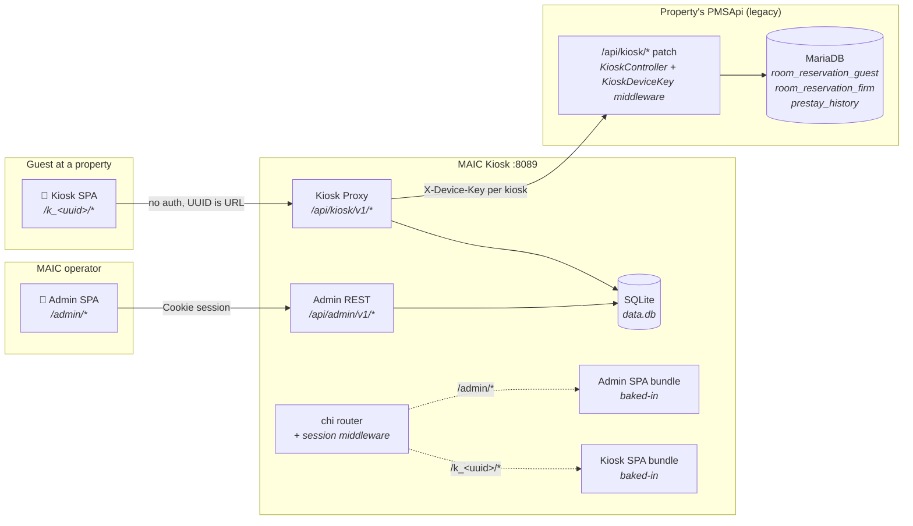
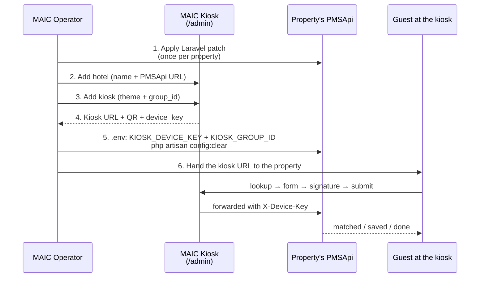

# 🛎️ MAIC Kiosk

[](https://golang.org/)
[](https://github.com/go-chi/chi)
[](https://sqlite.org/)
[](https://react.dev)
[](https://tailwindcss.com)
[](https://vitejs.dev)
[](https://docker.com)
[](LICENSE)

## About

**MAIC Kiosk** is the standalone, multi-tenant self check-in service for hotels running on the MAIC PMS. One Docker image hosts an internal operator admin panel, the guest-facing kiosk SPA, and the kiosk-to-PMS proxy. Operators register hotels and create check-in URLs from the admin panel; each kiosk URL is an opaque UUID that maps to a property's PMSApi backend plus a per-kiosk device key.

The service stores its own state — operators, hotels, kiosks, audit log — in a single SQLite file. It does **not** store guest reservations or any PMS data: every guest action is forwarded to the property's PMSApi (via the [`/api/kiosk/*` Laravel patch](./laravel-patch/README.md)) and persisted in the legacy `room_reservation_guest`, `room_reservation_firm`, and `prestay_history` tables. No new tables, no migrations on the property side.

Sibling of `AdminApi`, `PMSApi`, `AgentApi`, etc. in the [MAIC orchestrator](https://github.com/MaicSystem/maic-orchestration). Wired into `docker-compose.yml` as the `kiosk` service on port `8089`.

## Architecture Overview



**Trust boundaries:**

- Operator → admin API: bcrypt-hashed password + cookie-backed session (`HttpOnly`, `Secure`, `SameSite=Lax`, 12h sliding TTL). Per-user accounts in our SQLite, no public registration.
- Guest → kiosk API: knowing the UUID is the only authorisation. Disable a kiosk in the admin panel to kill it.
- Kiosk service → property's PMSApi: per-kiosk `X-Device-Key` (random hex), echoed in the property's `KIOSK_DEVICE_KEY` env. Plus tenant pinning via `KIOSK_GROUP_ID` so a kiosk can only see its own group's reservations.

## Repository Layout

```
.
├── go-server/                      Go binary: admin REST + kiosk proxy + SPA serving
│   ├── cmd/
│   │   ├── server/main.go          HTTP entrypoint
│   │   └── admin/main.go           Operator CLI (add-user, reset-password, …)
│   └── internal/
│       ├── store/                  SQLite repository layer (typed methods)
│       ├── auth/                   bcrypt + sessions + middleware
│       ├── admin/                  /api/admin/v1/* handlers
│       ├── kiosk/                  /api/kiosk/v1/* handlers + slug resolver
│       └── proxy/                  Allowlisted forwarder to legacy PMSApi
├── kiosk-spa/                      Guest-facing SPA (React 19 + Tailwind v4 + Zustand)
│   └── src/
│       ├── api/                    Wire types + axios client (slug-aware base URL)
│       ├── features/               landing / checkin / done / error
│       ├── components/             KioskShell, SignaturePad, IdleResetGuard, …
│       └── theme/                  Bundled themes: smart-moov, pareus
├── admin-spa/                      Internal operator panel (React 19 + Tailwind v4 + React Query)
│   └── src/
│       ├── api/                    fetch client w/ credentials: include
│       ├── features/               login / hotels / kiosks / audit
│       └── components/             Layout, RootGate
├── laravel-patch/                  Drop-in for the property's PMSApi
│   └── payload/app/Http/
│       ├── Middleware/KioskDeviceKey.php
│       └── Controllers/API/KioskController.php
├── docs/
│   ├── SERVICE_DESIGN_v2.md        Architecture, data model, threat model, contracts
│   ├── ADMIN_GUIDE.md              Operator runbook
│   ├── OPERATIONS.md               Sysadmin / SRE runbook
│   ├── PLAN_v2_ADMIN.md            Implementation plan (historical)
│   └── DOCUMENTATION.md            v1 review pack (historical, kept for traceability)
├── Dockerfile                      Multi-stage build of all three components
├── docker-compose.yml              Single-service local-dev compose
├── CONTRIBUTING.md
└── README.md
```

## Quick Start

### Run with Docker (standalone)

```bash
git clone git@github.com:MaicSystem/maic-kiosk.git Kiosk
cd Kiosk
docker compose up -d --build

# create the first operator
docker compose exec kiosk /app/admin add-user \
  --email you@maiccube.com --name "Your Name"

open http://localhost:8089/admin
```

### Run via the MAIC Orchestrator

The kiosk is wired into `MaicSystem/maic-orchestration`'s `docker-compose.yml` as the `kiosk` service. Once you have the orchestrator's sibling-clone setup (see its README), just:

```bash
cd Orchestration
docker compose up -d kiosk
docker compose exec kiosk /app/admin add-user \
  --email you@maiccube.com --name "Your Name"
```

The kiosk doesn't need to be on the same compose network as any specific property's PMSApi — it talks to property backends over HTTPS using `X-Device-Key`. So one orchestrator can manage check-in for any number of remote properties.

### Local dev (hot reload)

```bash
# Terminal 1 — Go server
cd go-server
DATA_PATH=$PWD/data/data.db ALLOWED_ORIGINS=http://localhost:5180,http://localhost:5181 \
  go run ./cmd/server

# Terminal 2 — kiosk SPA dev server
cd kiosk-spa && npm install && npm run dev    # :5180

# Terminal 3 — admin SPA dev server
cd admin-spa && npm install && npm run dev    # :5181/admin

# Terminal 4 — bootstrap an operator
cd go-server && DATA_PATH=$PWD/data/data.db go run ./cmd/admin add-user \
  --email you@local --name "Dev"
```

Vite proxies `/api/*` to `http://localhost:8089` so cookie auth works in dev. After login you can create a hotel + kiosk through the admin SPA, copy the URL, and open it in another tab to drive the guest flow.

## Onboarding a Property — In One Page



Full walkthrough in [`docs/ADMIN_GUIDE.md`](./docs/ADMIN_GUIDE.md).

## API Surface

### Admin REST `/api/admin/v1`

All except `/auth/login` require a session cookie (`kiosk_admin_session`).

| Method | Path | Purpose |
| ------ | --------------------------------- | --- |
| POST   | `/auth/login`                     | email + password → cookie |
| POST   | `/auth/logout`                    | revoke session |
| GET    | `/me`                             | current operator |
| GET    | `/hotels`                         | list (with kiosk counts) |
| POST   | `/hotels`                         | create |
| GET    | `/hotels/{id}`                    | hotel + its kiosks |
| PATCH  | `/hotels/{id}`                    | update |
| DELETE | `/hotels/{id}`                    | cascade-delete kiosks |
| POST   | `/hotels/{id}/kiosks`             | create kiosk (auto-generates UUID + key) |
| GET    | `/kiosks/{id}`                    | full row incl. device_key |
| PATCH  | `/kiosks/{id}`                    | update editable fields |
| POST   | `/kiosks/{id}/rotate-key`         | new device_key, revokes old |
| POST   | `/kiosks/{id}/disable`            | status='disabled' (returns 410) |
| POST   | `/kiosks/{id}/enable`             | status='active' |
| DELETE | `/kiosks/{id}`                    | hard delete |
| GET    | `/audit-log?limit=&before=`       | paginated activity |

### Public Kiosk REST `/api/kiosk/v1`

Routed by opaque kiosk UUID. Knowing the UUID is the only auth.

| Method | Path | Purpose |
| ------ | --------------------------------- | --- |
| GET    | `/health`                         | liveness |
| GET    | `/ready`                          | readiness — pings the DB |
| GET    | `/{uuid}/config`                  | sanitised public config (theme, name, langs) |
| POST   | `/{uuid}/lookup`                  | → property's `/api/kiosk/lookup` |
| POST   | `/{uuid}/select`                  | → property's `/api/kiosk/select` |
| POST   | `/{uuid}/form`                    | → property's `/api/kiosk/form` |
| POST   | `/{uuid}/save-guest`              | → property's `/api/kiosk/save-guest` |
| POST   | `/{uuid}/save-firm`               | → property's `/api/kiosk/save-firm` |
| POST   | `/{uuid}/submit`                  | → property's `/api/kiosk/submit` |

The proxy adds `X-Device-Key`, `X-Forwarded-For`, `Accept-Language`, and `X-Lookup-Method`/`X-Kiosk-Language` if the SPA sent them. Everything else is dropped to avoid leaking cookies or auth headers to the property.

### Configuration

| Var | Required | Default | Purpose |
| --- | --- | --- | --- |
| `PORT` | no | `8089` | listen port |
| `DATA_PATH` | no | `/data/data.db` | SQLite file (must persist) |
| `ALLOWED_ORIGINS` | yes in prod | `https://localhost` | CORS allowlist (comma-separated) |
| `UPSTREAM_TIMEOUT_MS` | no | `12000` | per-request timeout to property's PMSApi |
| `KIOSK_SPA_DIR` | no | `/app/kiosk-spa-dist` | bundled SPA path |
| `ADMIN_SPA_DIR` | no | `/app/admin-spa-dist` | bundled SPA path |

On the property's PMSApi `.env`:

| Var | Required | Purpose |
| --- | --- | --- |
| `KIOSK_DEVICE_KEY` | yes | Must match the value shown in the admin panel |
| `KIOSK_GROUP_ID` | yes | Property's `g_group.id`. Tenant pin. |
| `KIOSK_LOOKUP_WINDOW_DAYS` | no (2) | ± window around today for last-name lookup |
| `KIOSK_DEVICE_ID` | no | label written to `prestay_history.type` |

## Documentation

| Doc | For |
| --- | --- |
| [`docs/SERVICE_DESIGN_v2.md`](./docs/SERVICE_DESIGN_v2.md) | Engineers / reviewers — full architecture, data model, threat model, API contracts |
| [`docs/ADMIN_GUIDE.md`](./docs/ADMIN_GUIDE.md) | Operators — sign in, add hotels, generate kiosk URLs, rotate keys |
| [`docs/OPERATIONS.md`](./docs/OPERATIONS.md) | Sysadmins / SRE — deploy, backup, restore, monitoring, scaling |
| [`docs/PLAN_v2_ADMIN.md`](./docs/PLAN_v2_ADMIN.md) | Historical — the implementation plan that produced the current shape |
| [`docs/DOCUMENTATION.md`](./docs/DOCUMENTATION.md) | Historical — v1 review pack (YAML registry, single-property model) |
| [`laravel-patch/README.md`](./laravel-patch/README.md) | Property side — install steps for the `/api/kiosk/*` patch |
| [`CONTRIBUTING.md`](./CONTRIBUTING.md) | Engineers — dev loop, conventions, testing |

## Conventions

- **Backend** — Go 1.25, `database/sql` + `modernc.org/sqlite` (pure-Go, no CGO), `go-chi/chi v5`, `golang.org/x/crypto/bcrypt`. JSON in / JSON out. Errors return `{"error":{"code":"...","message":"..."}}` with appropriate HTTP status.
- **Frontends** — React 19, TypeScript strict, Tailwind v4. Kiosk SPA uses Zustand for state and React Aria for primitives; admin SPA uses React Query for data fetching.
- **No new DB schema on properties.** Every kiosk write goes into `room_reservation_guest`, `room_reservation_firm`, `prestay_history` — same shape as the existing `PreStayController`. Confirms cleanly with Feratel pickup, automation, and other downstream consumers.
- **Audit-by-default.** Every state-changing admin call writes one row to `audit_log` with secrets stripped. CLI actions log with `actor_email = cli:<unix user>`.

## Skills used

- `frontend-design` — bundled themes (smart-moov modern urban, pareus refined-coastal); plain professional admin chrome (slate + indigo).
- `mobile-design` — kiosk tap targets ≥ 56 px, thumb-zone CTAs.
- `simplify` — handlers stay thin; logic lives in `internal/store` and `internal/auth` so they're trivially testable without HTTP.
